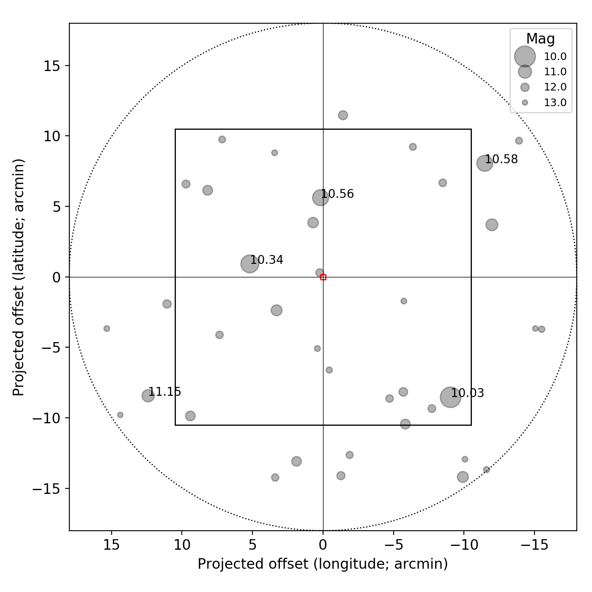

# ysobsplanpy

A simple small package to make a finding chart of your object using guide star catalogs.

## Requirements
```
numpy
astropy
astroquery (better to use the latest version)
matplotlib (optional but recommended)
```

## Usage

```python
%config InlineBackend.figure_format = 'retina'
from matplotlib import pyplot as plt
from matplotlib import rcParams
from ysobsplanpy import GuideStars


# We need to do it in a separate cell. See:
# https://github.com/jupyter/notebook/issues/3385
plt.style.use('default')
rcParams.update({'font.size':12})

# a random object SDSS J160336.42+155906.8 -- Quasar
g = GuideStars(ra=240.90177, dec=15.985262, radius=0.3, unit='deg')
g.query(mag_cut=13)
fig, axs = plt.subplots(1, 1, figsize=(7, 7),
                        sharex=False, sharey=False, gridspec_kw=None)
g.quickplot(axs, num_show_mag=5)

plt.tight_layout()
axs.set_aspect('equal')
fig.align_ylabels(axs)
fig.align_xlabels(axs)
plt.show()
```

